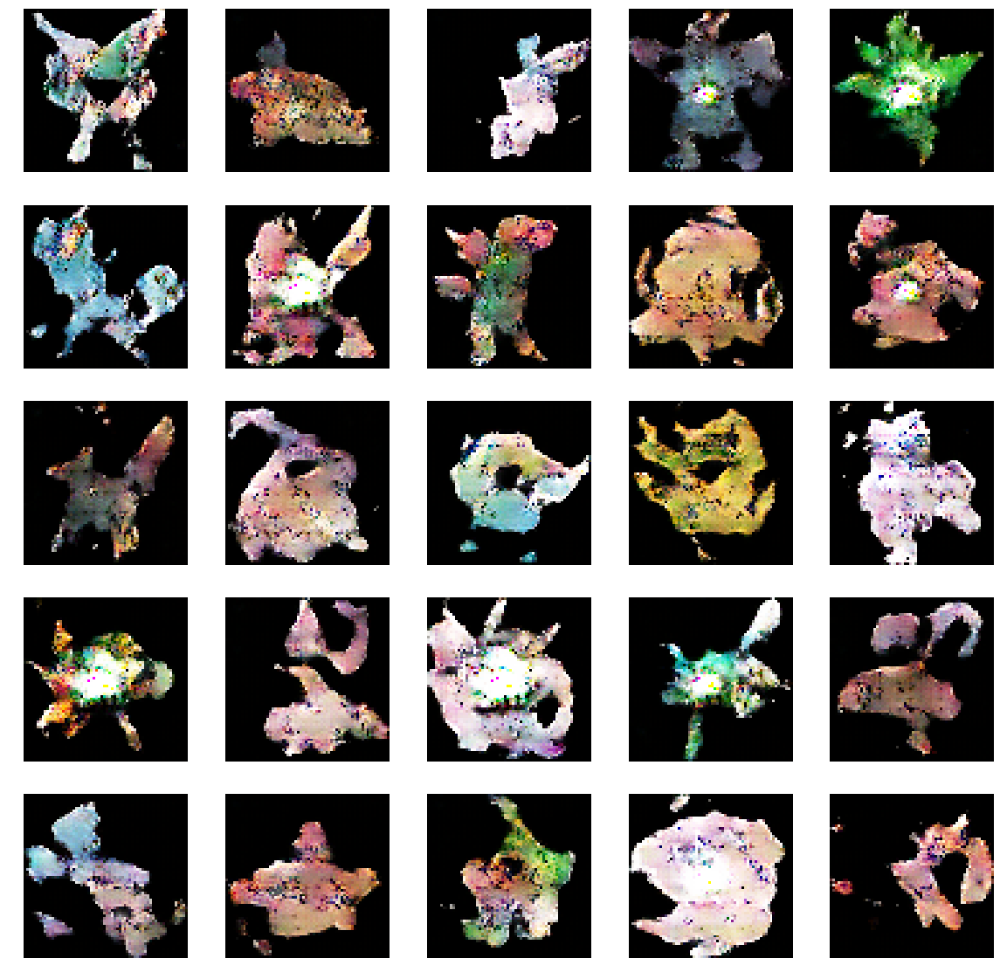

# PokemonDCGAN 

Generating new Pokemon with an implementation of DCGAN in Keras. 
# Method 

This model uses an implementation of [DCGAN](https://arxiv.org/abs/1511.06434), DCGAN is a type of generative adversarial network that uses randomly sampled noise to generate images. 

The GAN uses 2 networks working against each other, they both improve over the training, yielding better results. A discriminator network tries to detect which images are fakes and which are from our dataset, while the generator tries to produce increasingly realistic fakes to fool the discriminator.   

# Challenges 

Training a GAN is notoriously tricky, most of my experimentation came from testing different hyper-parameters and network sizes so that the generator and discriminator could be somewhat balanced. In early versions of this project the loss of the discriminator would rapidly approach 0 and the generator never really had a change to improve. 

# Results

Here are the results I was able to achieve training on google colab for a few hours.

# Sources / helpful materials
- [DCGAN](https://arxiv.org/abs/1511.06434)
- [GANs in Keras](https://www.youtube.com/watch?v=T-MCludVNn4)
- [PokeGan](https://github.com/llSourcell/Pokemon_GAN)
